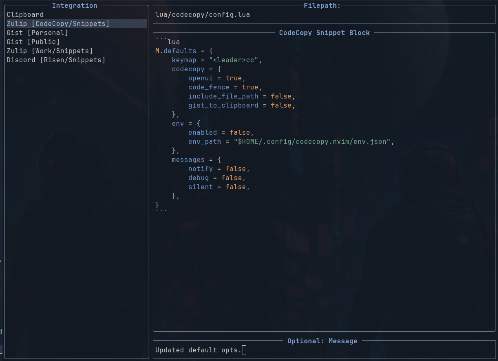

# 📋 codecopy.nvim

A simple Neovim plugin to copy selected text to the system clipboard.<br>
Wrapped in markdown code fences (for Discord, GitHub, etc). *(Optional via config)

[](https://neovim.io)
[](https://github.com/folke/lazy.nvim)
[](https://opensource.org/licenses/MIT)
[](https://github.com/MunifTanjim/nui.nvim)
[](https://discord.com)
[](https://gist.github.com)
[](https://slack.com)
[](https://zulip.com)

[→ Jump to Installation](#-installation)
[→ Jump to Usage](#-usage)
[→ Jump to API & Keymaps](#-api--keymaps)

Strives to be minimal, configurable, and fast.

---



---

## ✨ Features

- 📦 Copy visual selection to clipboard
- 💻 Wrap in code fences (e.g., \`\`\`lua )
- 🪐 Share CodeCopy snippets to Discord, Gist, Slack, and Zulip using optional integrations.
- 🗺️ Optional footer displaying file path ( */loc/of/some/file.txt* )
- 🔔 Optional notifications: silent (none), notify (info), or go full debug
- 🔧 User-configurable options and keymaps
- ⚙️ Expandable dynamic language detection
- 🧠 Minimal, fast, and fully Lua-based

---

## 🔌 Installation

Using [lazy.nvim](https://github.com/folke/lazy.nvim):

Minimal:

```lua
{
    "Zonric/codecopy.nvim",
    event = "VeryLazy",
    dependencies = { "MunifTanjim/nui.nvim" },
}
```

Default configuration:
    Unless you want to customize codecopy, none are needed.

```lua
{
    "Zonric/codecopy.nvim",
    branch = "master",
    enabled = true,
    lazy = true,
    event = "VeryLazy",
    dependencies = { "MunifTanjim/nui.nvim" },
    opts = { -- Default Configs
        -- sets Default keymap for ("codecopy.selection").copy()
        keymap = "<leader>cc",
        codecopy = {
            -- Open the ui automatically on a CodeCopy.
            openui = true,
            -- Wrap the code in a markdown code fence.
            code_fence = true,
            -- Include the file path after the markdown.
            include_file_path = false,
            -- You can have the url for the gist written to the clipboard
            gist_to_clipboard = false,
        },
        env = {
            -- Enable this to get the environment variables from the env_path.
            enabled = false,
            -- Feel free to change this to your liking.
            -- Just make sure to create the directory and the json file.
            env_path = "$HOME/.config/codecopy.nvim/env.json",
            -- See [Integrations](#Integrations) for more info.
        },
        messages = {
            -- Display info notifications. If false, errors will still be displayed.
            notify = true,
            -- Display info and debug notifications.
            debug = false,
            -- WARNING: If true, ALL Errors, Warnings, and Info notifications will be disabled.
            -- Overrides other notification settings.
            silent = false,
        },
    },
}
```

---

## 🗝️ Usage

In visual mode, highlight some text and press `<leader>cc` (or your custom mapping).
The text will be copied to the system clipboard and wrapped in a markdown code fence.
If you want to copy plain text, you can toggle `:CodeCopy toggle code_fence` on the fly.

### 🔗 Integrations

We use a json file that contains an array of objects, each object is the config for each integration.

We use this file to separate tokens from nvim configs so we can repo our nvim configs without leaking them.

Examples for each integration are below.

We currently support the following integrations:

| Name | Target |
|---|---|
| Discord | discord |
| Gist | gist |
| Slack | slackcompat |
| Zulip | zulip |

#### 📂 JSON File (`$HOME/.config/codecopy.nvim/env.json`)

The order of the list will determine how they are sorted in the integration list.<br>
- name: is the display name of the integration.<br>
- target: is the key name of the integration DON'T change this<br>
- filepath: If true, the file path will be appended to the message. This overrides the plugin setting `include_file_path`<br>
Plugins config `include_file_path` only applies to the clipboard.


```json
[
    {...},
    {...},
    {...},
    {...}
]
```

#### Discord:

```json
[
  {
    "name": "<DISCORD NAME>",
    "target": "discord",
    "author": "<YOURNAME>",
    "profile": "<URL to your site, social media, or profile>",
    "embed": false,
    "filepath": true,
    "url": "<YOUR-WEBHOOK-URL>"
  },
  {
    ..MORE INTEGRATIONS..
  }
]
```

#### Gist:

```json
[
  {
    ...MORE...
  },
  {
	"name": "<Gist Display Name>",
	"target": "gist",
	"public": "false",
	"token": "<TOKEN>",
  },
  {
    ..INTEGRATIONS..
  }
]
```

#### Slack or other Slack-compatible:

- untested, but should work.

```json
[
  {
    ...MORE...
  },
  {
	"name": "<Slack Display Name>",
	"target": "slackcompat",
	"channel": "C123456",
	"filepath": true,
	"token": "<YOUR-API-TOKEN>",
	"url": "https://slack.com/api/chat.postMessage"
  },
  {
    ..INTEGRATIONS..
  }
]
```

#### Zulip:

```json
[
  {
    ...MORE INTEGRATIONS...
  },
  {
	"name": "<Zulip Display Name>",
	"target": "zulip",
	"channel": 123456,
	"topic": "<TOPIC>",
	"filepath": true,
	"username": "<E-MAIL-OF-YOUR-BOT@YOUR-ZULIP-DOMAIN.com>",
	"token": "<YOUR-API-TOKEN>",
	"url": "<https://YOUR-ZULIP-DOMAIN.com/api/v1/messages>"
  }
]
```

🧠 Note: Replace placeholders with your actual config values, keep them private, and set your order.

---

# 🔧 API & Keymaps

| Command | Function | Description |
|----------|---------------------------------------------------------|------------------------------|
| CodeCopy | require("codecopy.selection").copy() | Manually trigger copy. |
| CodeCopy open ui | require("codecopy.ui").open() | Manually opens UI. |
| CodeCopy toggle openui | require("codecopy.config").toggle_openui() | Toggle auto open ui on CodeCopy. |
| CodeCopy toggle code_fence | require("codecopy.config").toggle_code_fence() | Toggle code block wrapping. |
| CodeCopy toggle notify | require("codecopy.config").toggle_notify() | Toggle copy notifications. |
| CodeCopy toggle include_file_path | require("codecopy.config").toggle_include_file_path() | Toggle displaying file path. |
| CodeCopy toggle debug | require("codecopy.config").toggle_debug() | Toggle debug notifications. |
| CodeCopy toggle gist_to_clipboard | require("codecopy.config").toggle_gist_to_clipboard() | Toggle gist integration changing clipboard to gist url. |

🧪 Example Keymaps

You can set your own keymap:

```lua
vim.keymap.set("v", "<leader>cc", "<CMD>CodeCopy<CR>", { desc = "CodeCopy to clipboard." })

vim.keymap.set("n", "<leader>cn", function()
 require("codecopy.config").toggle_notify()
end, { desc = "CodeCopy toggle notifications." })

vim.keymap.set({"n","v"}, "<leader>cg", "<CMD>CodeCopy toggle code_fence<CR>", { desc = "CodeCopy toggle fencing." })
```
